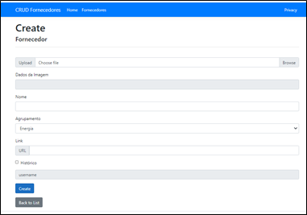

# DESAFIO CRUD FORNECEDORES

## Objetivo do Desafio

#### Critérios da avaliação

Será avaliado a lógica de programação, conformidade do layout, conhecimentos nas linguagens propostas,
tratamento de falhas, padrões de projeto, testes e boas práticas de programação no geral.
Forma de envio da avaliação

#### Informações sobre o desenvolvimento

Linguagens: C#, ASP.NET, HTML, CSS, Vue /JavaScript/Jquery.
Arquitetura: MVC / CQRS
Ferramentas/Frameworks: Visual Studio, Bootstrap, Entity Framework ou NHibernate ou Dapper e
banco de dados SQL Server (Express) ou RavenDB.

#### Atividade do Desafio:

Criar uma interface para gestão de fornecedores, a qual o usuário poderá gerir os fornecedores para sua gestão.

Abaixo segue uma tela que deve ser seguida para o cadastro e edição de um fornecedor. A tela de lista e ação
de exclusão, devem ser implementadas conforme sua experiência em UX (User Experience).

## Requisitos, Clone e Instalação

#### Requisitos necessários:

- .net core sdk (https://dotnet.microsoft.com/download)

- Serviço de Banco de Dados dependendo da sua escolha:

    + SQL Server Express (https://www.microsoft.com/pt-br/sql-server/sql-server-downloads)

    + ou MySQL (https://www.mysql.com/downloads/)

#### Clone e Instalação

Realize o [clone do repositório](https://docs.github.com/pt/free-pro-team@latest/github/creating-cloning-and-archiving-repositories/cloning-a-repository), após concluído acesse a pasta raiz do projeto e execute `dotnet restore` para instalar as dependências.

## Banco de Dados

O backend dos projetos necessitam do serviço do SQL rodando na máquina servidora, para criação do banco dos dados por favor utilize os arquivos da pasta `\create_mysql\...`.

Será necessário configurar a conexão com o banco de dados e após a configuração realizar a atualização do banco de dados por linha de comando.

#### Instruções para banco SQL Express

Configure a conexão pelo arquivo `appsettings.json` na pasta `Desafio_bd_SQLExpress\`.

>   "ConnectionStrings": {
    "FornecedoresContext": "Server=.;Database=fornecedores_schema;User Id=sa;Password=102938"
  },

Substitua as informações de user e password.

#### Atualização do Banco SQL Express

Verifique se a pasta `Migrations` possuem os seguintes arquivos (3):

* 20210114212130_InitialCreate.cs
* 20210114212130_InitialCreate.Designer.cs
* FornecedoresContextModelSnapshot.cs

Estando todos presentes execute os comandos abaixo no terminal de sua escolha, desde que compativel com o `dotnet`.

* dotnet ef database update

#### Instruções para banco MySQL

Configure a conexão pelo arquivo `Startup.cs` na pasta `Desafio_bd_MySql\`.

Linha 38

>   "server=localhost;user=root;password=10293847;database=app-dotnet-guiando"

Substitua as informações de user e password.

#### Atualização do Banco MySQL

Verifique se a pasta `Migrations` possuem os seguintes arquivos (3):

* 20210114035245_InitialCreate.cs
* 20210114035245_InitialCreate.Designer.cs
* FornecedoresContextModelSnapshot.cs

Estando todos presentes execute os comandos abaixo no terminal de sua escolha, desde que compativel com o `dotnet`.

* dotnet ef database update

## Desenvolvimento e teste

Execute `dotnet run` para um servidor de desenvolvimento, navegue até `http://localhost:5001`. 

## Pendências

- Detalhar tutorial com construção da solução do zero.
- Criar um terceiro projeto com Auth Individual.
- Publicar no Azure para teste.

## Imagens das Telas (SQL Express)

